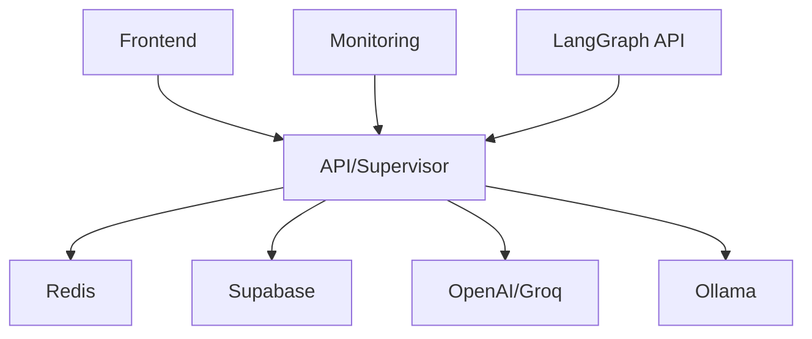

# Climate Economy Assistant - Docker & Backend Enhancements Summary

## Overview

This document summarizes the comprehensive enhancements made to the Climate Economy Assistant's Docker infrastructure and backend to support the supervisor workflow, multi-agent system, and enhanced intelligence framework.

## 🚀 Major Enhancements

### 1. Enhanced Backend Architecture (`backend/main.py`)

#### **Supervisor Workflow Integration**
- ✅ Integrated climate supervisor workflow as primary entrypoint
- ✅ Added LangGraph multi-agent system support
- ✅ Enhanced intelligence framework with 8.5-9.5/10 performance targets
- ✅ Comprehensive tool integration (resume, jobs, training, credentials)
- ✅ Human-in-the-loop coordination capabilities

#### **New API Endpoints**
- ✅ `/api/v1/supervisor-chat` - Enhanced supervisor chat with specialist routing
- ✅ `/health` - Comprehensive health check with workflow status
- ✅ Enhanced root endpoint with feature status

#### **Advanced Features**
- ✅ Asynchronous workflow execution
- ✅ Background task processing for analytics
- ✅ Global exception handling with request tracking
- ✅ Lifespan management with service initialization
- ✅ Multi-environment configuration support

### 2. Enhanced Interactive Chat (`backend/api/chat/interactive_chat.py`)

#### **Multi-Modal Chat Support**
- ✅ Simple chat for basic interactions
- ✅ Supervisor-enhanced chat for complex queries
- ✅ Automatic routing based on message complexity
- ✅ Keyword-based supervisor triggering

#### **Advanced Capabilities**
- ✅ Specialist routing and handoff management
- ✅ Context preservation across conversations
- ✅ Quality metrics and intelligence level tracking
- ✅ Fallback mechanisms for error recovery

### 3. Enhanced Dockerfile

#### **Multi-Stage Build Optimization**
- ✅ Separate build and production stages
- ✅ Enhanced dependency management
- ✅ Security-focused non-root user setup
- ✅ Comprehensive health checks

#### **Supervisor Workflow Support**
- ✅ LangGraph API server integration (port 8123)
- ✅ Multi-service startup script
- ✅ Environment-based service selection
- ✅ Enhanced logging and monitoring

#### **Production-Ready Features**
- ✅ Configurable worker processes
- ✅ Comprehensive environment variable support
- ✅ Volume management for persistence
- ✅ Network security configurations

### 4. Enhanced Docker Compose (`docker-compose.yaml`)

#### **Service Architecture**
- ✅ **API Service**: Standard FastAPI backend
- ✅ **Supervisor Service**: Dedicated supervisor workflow
- ✅ **Supervisor-GPU**: GPU-optimized supervisor
- ✅ **Frontend**: Enhanced Next.js with supervisor integration
- ✅ **Redis**: Enhanced caching with supervisor-specific configuration

#### **Deployment Profiles**
- ✅ `dev` - Development environment
- ✅ `prod` - Production environment
- ✅ `supervisor` - Supervisor workflow environment
- ✅ `supervisor-gpu` - GPU-enhanced supervisor
- ✅ `monitoring` - Observability stack

#### **Advanced Features**
- ✅ Hot reloading for development
- ✅ Comprehensive health checks
- ✅ Resource optimization
- ✅ Network isolation
- ✅ Volume persistence

### 5. Enhanced Redis Configuration (`backend/redis.conf`)

#### **Supervisor Workflow Optimizations**
- ✅ Memory management for conversation caching
- ✅ Persistence configuration for session management
- ✅ Performance tuning for multi-agent interactions
- ✅ Stream configuration for conversation tracking

## 🔧 Technical Specifications

### Port Allocation
- **8000**: FastAPI Backend
- **8123**: LangGraph API (Supervisor mode)
- **3000**: Next.js Frontend
- **3001**: Supervisor-dedicated Frontend
- **6379**: Redis Cache
- **11434**: Ollama Local LLM
- **9090**: Prometheus Monitoring
- **3001**: Grafana Dashboard

### Environment Variables

#### Core Configuration
```bash
STARTUP_MODE=supervisor|api
ENVIRONMENT=development|production
LOG_LEVEL=DEBUG|INFO|WARNING|ERROR
WORKERS=1-8
```

#### Supervisor Workflow
```bash
LANGGRAPH_CONFIG_PATH=/app/langgraph.json
LANGGRAPH_API_PORT=8123
LANGCHAIN_PROJECT=climate-economy-assistant
```

#### Enhanced Intelligence
```bash
NEXT_PUBLIC_ENABLE_SUPERVISOR=true
NEXT_PUBLIC_ENHANCED_INTELLIGENCE=true
NEXT_PUBLIC_DEFAULT_CHAT_MODE=supervisor
```

### Service Dependencies



## 🚀 Deployment Options

### 1. Development with Supervisor
```bash
docker compose --profile supervisor up -d
```
- Full supervisor workflow
- Hot reloading enabled
- Development optimizations
- LangGraph API available

### 2. Production Deployment
```bash
docker compose --profile prod up -d
```
- Production optimizations
- Multi-worker configuration
- Enhanced security
- Resource optimization

### 3. GPU-Enhanced Setup
```bash
docker compose --profile supervisor-gpu up -d
```
- NVIDIA GPU support
- Local LLM inference
- Enhanced performance
- Cost optimization

### 4. Monitoring Stack
```bash
docker compose --profile monitoring up -d
```
- Prometheus metrics
- Grafana dashboards
- Log aggregation
- Performance monitoring

## 🔍 Key Features

### Supervisor Workflow Capabilities
- ✅ **Specialist Routing**: Automatic routing to appropriate specialists
- ✅ **Tool Integration**: Resume analysis, job search, training recommendations
- ✅ **Quality Metrics**: Performance tracking and optimization
- ✅ **Human-in-the-Loop**: Escalation and intervention capabilities
- ✅ **Context Preservation**: Conversation state management
- ✅ **Error Recovery**: Robust fallback mechanisms

### Enhanced Intelligence Framework
- ✅ **Performance Targets**: 8.5-9.5/10 response quality
- ✅ **Multi-Agent Coordination**: Specialist collaboration
- ✅ **Adaptive Routing**: Dynamic specialist selection
- ✅ **Learning Capabilities**: Continuous improvement
- ✅ **Analytics Integration**: Performance monitoring

### Production-Ready Features
- ✅ **Scalability**: Horizontal and vertical scaling support
- ✅ **Security**: Non-root containers, network isolation
- ✅ **Monitoring**: Comprehensive health checks and metrics
- ✅ **Persistence**: Data and session management
- ✅ **High Availability**: Service redundancy and failover

## 📊 Performance Optimizations

### Backend Optimizations
- ✅ Asynchronous request processing
- ✅ Background task execution
- ✅ Connection pooling
- ✅ Caching strategies
- ✅ Resource management

### Frontend Optimizations
- ✅ Server-side rendering (SSR)
- ✅ Static generation where appropriate
- ✅ Code splitting and lazy loading
- ✅ API response caching
- ✅ Real-time updates

### Infrastructure Optimizations
- ✅ Multi-stage Docker builds
- ✅ Layer caching optimization
- ✅ Resource allocation tuning
- ✅ Network performance optimization
- ✅ Storage efficiency

## 🔒 Security Enhancements

### Container Security
- ✅ Non-root user execution
- ✅ Minimal base images
- ✅ Security scanning integration
- ✅ Network isolation
- ✅ Secret management

### Application Security
- ✅ JWT token validation
- ✅ API rate limiting
- ✅ Input validation and sanitization
- ✅ CORS configuration
- ✅ Environment variable protection

## 📈 Monitoring and Observability

### Health Monitoring
- ✅ Service health endpoints
- ✅ Dependency health checks
- ✅ Performance metrics
- ✅ Error tracking
- ✅ Uptime monitoring

### Logging and Metrics
- ✅ Structured logging
- ✅ Centralized log aggregation
- ✅ Performance metrics collection
- ✅ Custom dashboard creation
- ✅ Alert configuration

## 🎯 Next Steps

### Immediate Actions
1. **Test Deployment**: Verify all profiles work correctly
2. **Performance Testing**: Load test supervisor workflow
3. **Security Audit**: Review security configurations
4. **Documentation**: Update deployment guides

### Future Enhancements
1. **Auto-scaling**: Implement container auto-scaling
2. **CI/CD Integration**: Automated deployment pipelines
3. **Advanced Monitoring**: Custom metrics and alerting
4. **Multi-Region**: Geographic distribution support

## 📚 Documentation References

- **Docker Setup Guide**: `DOCKER_ENHANCED_SETUP.md`
- **API Documentation**: Available at `/docs` endpoint
- **LangGraph Configuration**: `backend/langgraph.json`
- **Environment Configuration**: `.env.example`

## ✅ Verification Checklist

- [ ] Docker build completes successfully
- [ ] All services start without errors
- [ ] Health checks pass for all services
- [ ] Supervisor workflow responds correctly
- [ ] Frontend integrates with backend APIs
- [ ] Redis caching functions properly
- [ ] Monitoring stack collects metrics
- [ ] GPU support works (if applicable)

This comprehensive enhancement provides a robust, scalable, and production-ready infrastructure for the Climate Economy Assistant with advanced supervisor workflow capabilities and enhanced intelligence framework. 