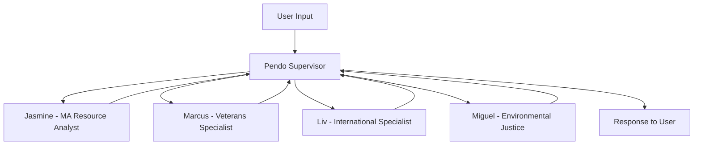

# Climate Economy Assistant Supervisor Workflow Documentation

## Overview

The **Climate Economy Assistant Supervisor Workflow** is a sophisticated multi-agent system built using LangGraph's supervisor pattern. It addresses the **39% information gap crisis** affecting clean energy workers and connects users to the **38,100 clean energy jobs pipeline by 2030** in Massachusetts.

## Architecture

### Supervisor Pattern Implementation

The workflow follows the LangGraph supervisor pattern with:
- **1 Supervisor Agent** (Pendo) for intelligent routing and coordination
- **4 Specialist Agents** for domain-specific expertise
- **Comprehensive tool integration** using all existing backend tools
- **Enhanced state management** for complex user profiles



## Agents

### 🎯 Pendo - Enhanced Supervisor Agent

**Role**: Lead Program Manager and intelligent routing coordinator

**Capabilities**:
- **Smart routing** based on user profiles and needs
- **Multi-identity recognition** for complex scenarios
- **Task delegation** with detailed instructions
- **Resource coordination** across specialists
- **Barrier analysis** and removal strategies

**Routing Intelligence**:
1. **Resume/Career Analysis** → Jasmine
2. **Military Background** → Marcus
3. **International Credentials** → Liv
4. **Environmental Justice/Community** → Miguel
5. **Complex Multi-Identity** → Coordinate multiple specialists
6. **General Climate Careers** → Start with Jasmine

### 👩‍💼 Jasmine - MA Resource Analyst

**Expertise**: Resume analysis, job matching, career pathway optimization

**Tools Available**:
- `analyze_resume_for_climate_careers`
- `analyze_resume_with_social_context`
- `process_resume`
- `extract_skills_from_resume`
- `match_jobs_for_profile`
- `recommend_upskilling`
- `search_job_resources`
- `search_education_resources`

**Mission**: Connect users to 38,100 clean energy jobs through data-driven analysis

### 🎖️ Marcus - Veterans Specialist

**Expertise**: Military skill translation, veteran-specific support, transition planning

**Tools Available**:
- `web_search_for_mos_translation`
- `web_search_for_veteran_resources`
- `translate_military_skills`
- `match_jobs_for_profile`
- `recommend_upskilling`
- `analyze_resume_for_climate_careers`

**Mission**: Help veterans transition to Massachusetts clean energy careers

### 🌍 Liv - International Specialist

**Expertise**: Credential evaluation, visa pathways, international professional integration

**Tools Available**:
- `web_search_for_credential_evaluation`
- `evaluate_credentials`
- `search_education_resources`
- `search_partner_organizations`
- `match_jobs_for_profile`
- `recommend_upskilling`

**Mission**: Support international professionals in Massachusetts climate economy

### 🌱 Miguel - Environmental Justice Specialist

**Expertise**: Environmental justice advocacy, community organizing, Gateway Cities focus

**Tools Available**:
- `web_search_for_ej_communities`
- `get_ej_community_info`
- `search_partner_organizations`
- `search_funding_resources`
- `search_events`
- `match_jobs_for_profile`

**Mission**: Ensure equitable access to clean energy careers in underserved communities

## State Management

### ClimateAgentState

Enhanced state object that extends `MessagesState`:

```python
class ClimateAgentState(MessagesState):
    user_id: str
    conversation_id: str
    current_specialist: Optional[str] = None
    user_profile: Optional[Dict[str, Any]] = None
    climate_goals: Optional[List[str]] = None
    geographic_focus: Optional[str] = None  # Gateway Cities focus
    barriers_identified: Optional[List[str]] = None
    tools_used: List[str] = []
    confidence_score: float = 0.0
    workflow_state: Literal["active", "pending_human", "completed"] = "active"
    specialist_handoffs: List[Dict[str, Any]] = []
    resource_recommendations: List[Dict[str, Any]] = []
    next_actions: List[str] = []
```

## Handoff System

### Two Types of Agent Communication

#### 1. **Full Conversation Transfer**
```python
assign_to_jasmine()  # Transfer complete conversation context
assign_to_marcus()   # Hand off all message history
assign_to_liv()      # Full context transfer
assign_to_miguel()   # Complete conversation handoff
```

#### 2. **Task Delegation**
```python
delegate_to_jasmine(task_description="Analyze this resume for solar energy roles")
delegate_to_marcus(task_description="Translate Navy Electronics Technician to clean energy")
delegate_to_liv(task_description="Evaluate engineering degree from India for MA jobs")
delegate_to_miguel(task_description="Find environmental justice opportunities in Brockton")
```

## Tools Integration

### Complete Tool Integration by Specialist

**Research & Coordination Tools**:
- `search_resources`
- `semantic_resource_search`
- `generate_resource_recommendations`
- `web_search_for_training_enhancement`
- `web_search_for_education_resources`

**Analytics & Tracking**:
- `log_specialist_interaction`
- `log_conversation_analytics`
- `log_resource_view`
- `log_user_feedback`
- `extract_conversation_insights`

## Gateway Cities Focus

**Target Geographic Areas**:
- **Brockton**: Environmental justice initiatives
- **Fall River/New Bedford**: Maritime renewable transition
- **Lowell/Lawrence**: Manufacturing to clean energy pivot

**Target Demographics**:
- **47% women** in clean energy workforce
- **50% Black respondents** facing information gaps
- **72% Hispanic/Latino** with geographic barriers

## Usage Examples

### Basic Conversation Flow

```python
# User starts conversation
user_input = "I'm a military veteran interested in clean energy careers"

# Supervisor routes to Marcus (Veterans Specialist)
supervisor_decision = assign_to_marcus()

# Marcus processes with military-specific tools
marcus_response = translate_military_skills(mos="25B", target_sector="renewable_energy")

# Returns to supervisor for coordination
coordination_response = "Based on your Signal/IT background, here are clean energy opportunities..."
```

### Multi-Specialist Coordination

```python
# Complex user profile: International veteran with EJ interests
user_profile = {
    "background": ["military", "international", "environmental_justice"],
    "location": "Lowell",
    "credentials": "Engineering degree from Germany"
}

# Supervisor coordinates multiple specialists:
# 1. Marcus: Military transition planning
# 2. Liv: International credential evaluation  
# 3. Miguel: EJ opportunities in Lowell
# 4. Jasmine: Final job matching and career planning
```

## API Integration

### LangGraph Configuration

Added to `langgraph.json`:
```json
{
  "graphs": {
    "climate_supervisor": "./api/workflows/climate_supervisor_workflow.py:climate_supervisor_graph"
  }
}
```

### Endpoint Access

**Local Development**:
- Base URL: `http://localhost:2024`
- Workflow ID: `climate_supervisor`

**Production Deployment**:
- Cloudflare Tunnel URL provided at startup
- LangGraph Studio UI integration

## Error Handling & Fallbacks

### Graceful Degradation

1. **Create React Agent Unavailable**:
   ```python
   if not CREATE_REACT_AGENT_AVAILABLE:
       return fallback_agent_structure
   ```

2. **Circular Import Protection**:
   ```python
   # Direct OpenAI import to avoid circular dependencies
   from langchain_openai import ChatOpenAI
   ```

3. **Specialist Error Recovery**:
   ```python
   try:
       specialist_response = await specialist.handle_request()
   except Exception as e:
       return fallback_specialist_response()
   ```

## Performance Optimization

### Tool Loading Strategy

- **Lazy loading** of specialist agents
- **Cached tool binding** for frequently used functions
- **Async processing** for parallel tool execution

### State Optimization

- **Minimal state passing** between agents
- **Efficient message handling** with format compatibility
- **Smart caching** of user profiles and preferences

## Testing & Validation

### Test Coverage

```python
async def test_workflow():
    test_state = ClimateAgentState(
        messages=[HumanMessage(content="Test scenario")],
        user_id="test_user_001",
        conversation_id="test_conv_001"
    )
    
    result = await climate_supervisor_graph.ainvoke(test_state)
    assert result.get('current_specialist') is not None
```

### Validation Scenarios

1. **Single specialist routing** (simple cases)
2. **Multi-specialist coordination** (complex profiles)
3. **Error recovery** (tool failures, network issues)
4. **State persistence** (conversation continuity)

## Deployment Considerations

### Environment Variables Required

```bash
OPENAI_API_KEY=your_openai_api_key
SUPABASE_URL=your_supabase_url
SUPABASE_SERVICE_ROLE_KEY=your_supabase_key
```

### Production Configuration

- **Rate limiting** on tool calls
- **Authentication** for sensitive operations
- **Monitoring** and analytics integration
- **Scaling** for high-volume usage

## Monitoring & Analytics

### Specialist Interaction Tracking

```python
await log_specialist_interaction(
    specialist_type="jasmine",
    user_id=user_id,
    conversation_id=conversation_id,
    query=user_message,
    tools_used=tools_used,
    confidence=confidence_score
)
```

### Conversation Analytics

- **User journey mapping** across specialists
- **Tool usage patterns** and effectiveness
- **Barrier identification** and resolution tracking
- **Success metrics** for job placements

## Integration with Existing Systems

### Compatibility with Current Workflows

- **climate_agent**: Core climate career guidance
- **resume_agent**: Resume processing and analysis
- **career_agent**: Career pathway planning
- **interactive_chat**: Real-time chat interface

### Data Flow Integration

```python
# Supervisor can coordinate with existing workflows
existing_resume_data = await get_user_resume(user_id)
specialist_analysis = await jasmine.analyze_resume(existing_resume_data)
coordinated_response = await supervisor.synthesize_recommendations()
```

## Future Enhancements

### Planned Improvements

1. **Machine Learning Integration**:
   - Predictive routing based on user patterns
   - Success rate optimization for specialist assignments

2. **Advanced Coordination**:
   - Multi-agent parallel processing
   - Collaborative problem-solving workflows

3. **Enhanced Analytics**:
   - Real-time dashboard for coordinator insights
   - Predictive barrier identification

4. **Extended Tool Integration**:
   - External API connections (job boards, training platforms)
   - Real-time labor market data integration

## Troubleshooting

### Common Issues

1. **Circular Import Errors**:
   - Symptom: ImportError during workflow loading
   - Solution: Use direct imports instead of adapter functions

2. **Agent Creation Failures**:
   - Symptom: Fallback mode activation
   - Solution: Check OpenAI API key and LangGraph version

3. **Tool Binding Issues**:
   - Symptom: Tools not available to agents
   - Solution: Verify tool imports and function signatures

### Debug Commands

```bash
# Test workflow import
python -c "from api.workflows.climate_supervisor_workflow import climate_supervisor_graph; print('✅ Success')"

# Check LangGraph status
curl http://localhost:2024/docs

# List loaded assistants
curl -X POST "http://localhost:2024/assistants/search" -H "Content-Type: application/json" -d '{}'
```

## Contributing

### Adding New Specialists

1. Create agent handler function
2. Define tool collection
3. Add handoff tools
4. Update routing logic
5. Add to workflow graph

### Extending Tool Integration

1. Import new tools in appropriate collections
2. Update specialist capabilities
3. Test tool binding and execution
4. Document new functionality

---

## Summary

The Climate Economy Assistant Supervisor Workflow represents a **comprehensive solution** to the Massachusetts clean energy career guidance challenge. By intelligently routing users to specialized agents and coordinating complex multi-identity scenarios, it directly addresses the **39% information gap** while connecting users to the **38,100 job pipeline**.

**Key Success Factors**:
- ✅ **Intelligent routing** based on user profiles
- ✅ **Comprehensive tool integration** using all existing capabilities  
- ✅ **Scalable architecture** with fallback protection
- ✅ **Analytics integration** for continuous improvement
- ✅ **Gateway Cities focus** for underserved communities

This documentation provides the foundation for deployment, maintenance, and future enhancement of the supervisor workflow system. 