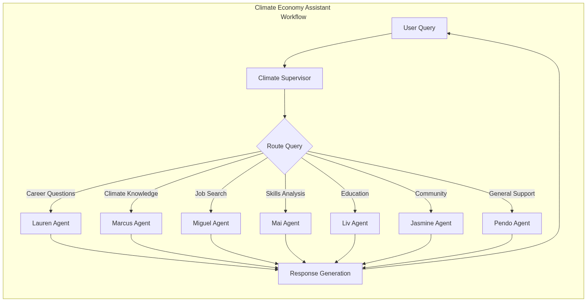
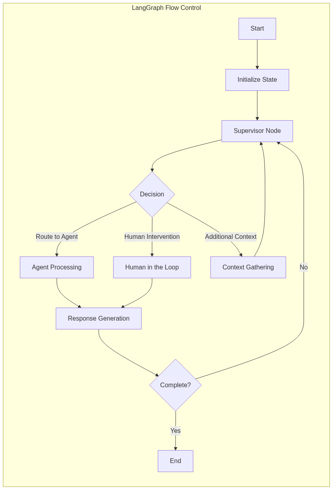
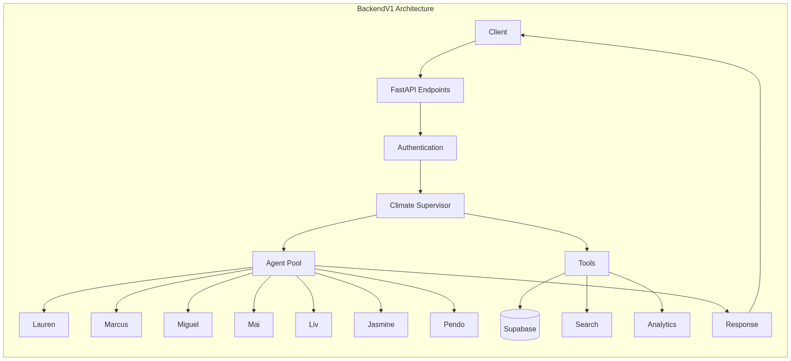
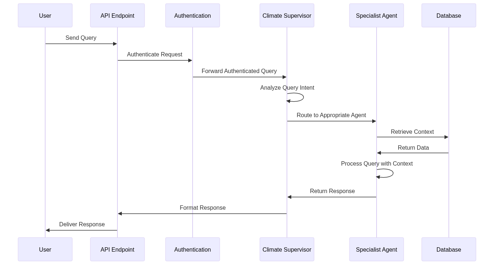
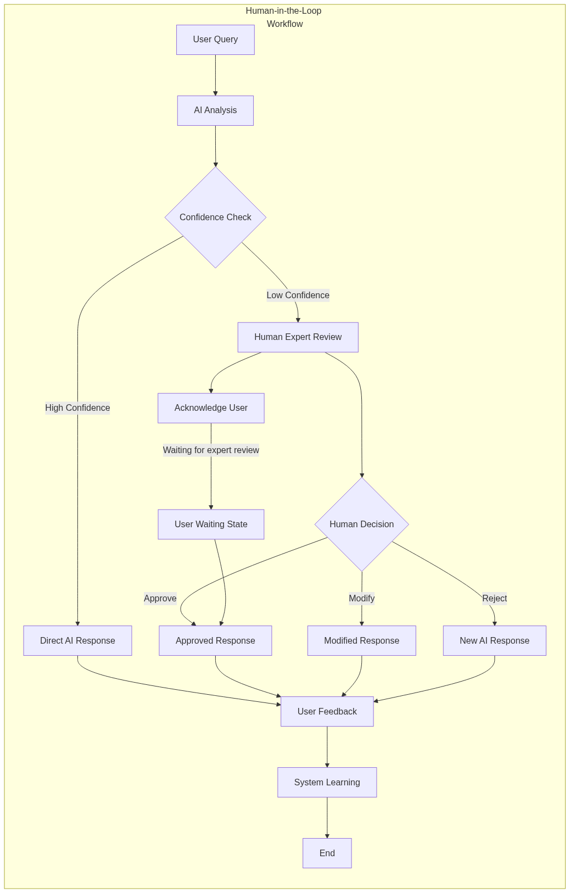

# Climate Economy Assistant Workflows

This directory contains documentation and diagrams for the various workflows in the Climate Economy Assistant project.

## Workflow Diagrams

The [WORKFLOW_DIAGRAMS.md](WORKFLOW_DIAGRAMS.md) file contains mermaid diagrams that visualize the key workflows in the system. These diagrams have been exported as PNG images in the [images](images/) directory.

### Main Agent Workflow

The Climate Economy Assistant uses a supervisor agent that routes queries to specialized agents based on the query content. Each agent is specialized in a particular domain:

- **Lauren**: Career questions and guidance
- **Marcus**: Climate knowledge and information
- **Miguel**: Job search and opportunities
- **Mai**: Skills analysis and development
- **Liv**: Education and training
- **Jasmine**: Community and networking
- **Pendo**: General support and assistance

### LangGraph Flow Control

The LangGraph workflow system manages state and flow control between different nodes in the agent system. It handles:

- State initialization and management
- Decision routing to appropriate processing nodes
- Human-in-the-loop intervention
- Context gathering
- Response generation

### BackendV1 Architecture

The BackendV1 system architecture shows how components interact, including:

- FastAPI endpoints for client communication
- Authentication layer
- Climate Supervisor for query routing
- Agent Pool with specialized agents
- Tools for database access, search, and analytics

### Query Processing Sequence

The sequence diagram shows the flow of a user query through the system:

1. User sends a query to the API endpoint
2. Query is authenticated
3. Supervisor analyzes query intent
4. Query is routed to appropriate specialist agent
5. Agent retrieves context from database
6. Agent processes query with context
7. Response is formatted and delivered to user

### Human-in-the-Loop Workflow

The system includes human review for low-confidence responses:

1. AI analyzes user query
2. Confidence check determines if human review is needed
3. High confidence responses are sent directly to user
4. Low confidence responses are reviewed by human experts
5. Human can approve, modify, or reject the response
6. User is always acknowledged during the review process
7. User feedback is collected for system learning

## Implementation Details

For implementation details of these workflows, see:

- [LANGGRAPH_SETUP.md](LANGGRAPH_SETUP.md) - Setup of LangGraph
- [LANGGRAPH_WORKFLOWS_V1.md](LANGGRAPH_WORKFLOWS_V1.md) - V1 of LangGraph workflows
- [SUPERVISOR_INTEGRATION.md](SUPERVISOR_INTEGRATION.md) - Integration of supervisor
- [TECHNICAL_SUPERVISOR_INTEGRATION.md](TECHNICAL_SUPERVISOR_INTEGRATION.md) - Technical supervisor integration
