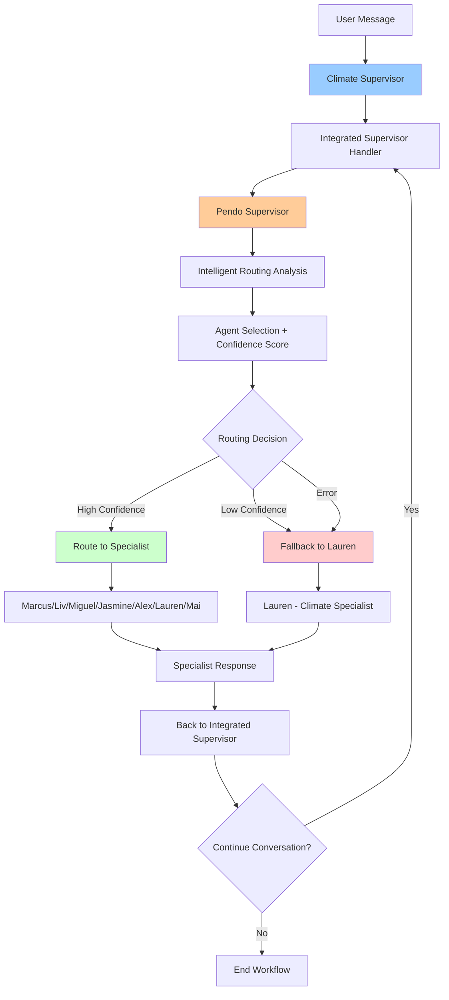

# Supervisor Integration - Pendo + Climate Workflow

## 🔄 **Integration Status: COMPLETED**

The Climate Economy Assistant now uses an **integrated supervisor architecture** where the Climate Supervisor acts as the master orchestrator and uses Pendo Supervisor for intelligent routing decisions.

## 🏗️ **Architecture Overview**

### **Before Integration (Parallel Systems)**
```
User Request
    ├── Climate Supervisor (Separate)
    └── Pendo Supervisor (Separate)
```

### **After Integration (Hierarchical System)**
```
User Request
    └── Climate Supervisor (Master)
        └── Pendo Supervisor (Intelligent Router)
            └── Specialist Agents
```

## 🎯 **How Integration Works**

### **1. Climate Supervisor as Master Orchestrator**
```python
class ClimateSupervisorWorkflow:
    def __init__(self):
        self.flow_controller = FlowController()
        self.agents = self._initialize_agents()
        # 🔥 NEW: Pendo integration
        self.pendo_supervisor = PendoSupervisorWorkflow()
        self.graph = self._create_workflow_graph()
```

### **2. Integrated Supervisor Handler**
```python
async def _integrated_supervisor_handler(self, state: ClimateAgentState):
    # Use Pendo for intelligent routing
    pendo_response = await self.pendo_supervisor.process_user_message(
        user_message=user_message,
        user_id=state.user_id,
        conversation_id=state.conversation_id,
        user_profile=state.user_profile,
        session_data=getattr(state, 'session_data', {})
    )
    
    # Extract routing decision
    routing_recommendation = pendo_response.metadata.get("routing_recommendation", "lauren")
    
    # Apply Pendo's routing decision to Climate workflow
    state_updates = {
        "routing_decision": {
            "specialist": routing_recommendation,
            "confidence": pendo_response.confidence_score,
            "reasoning": pendo_response.metadata.get("routing_reasoning")
        },
        "pendo_integrated": True
    }
```

### **3. Intelligent Routing with Fallback**
```python
def _route_from_integrated_supervisor(self, state: ClimateAgentState) -> str:
    # Get Pendo's routing decision
    routing_decision = getattr(state, 'routing_decision', {})
    current_specialist = routing_decision.get('specialist')
    
    # Validate and route to Pendo's choice
    if current_specialist and current_specialist in self.agents:
        logger.info(f"🎯 Pendo routed to: {current_specialist}")
        return current_specialist
    
    # Fallback if Pendo integration fails
    logger.info("🔄 Fallback to Lauren (climate specialist)")
    return "lauren"
```

## 🚀 **Benefits of Integration**

### **✅ Best of Both Worlds**
- **Climate Supervisor**: Robust LangGraph workflow management
- **Pendo Supervisor**: Intelligent agent routing and human-in-the-loop
- **Combined**: Sophisticated orchestration with smart routing

### **✅ Enhanced Capabilities**
1. **Human-in-the-Loop**: Pendo's crisis intervention integrated into workflow
2. **Streaming Support**: Real-time conversation updates
3. **Session Management**: Comprehensive conversation tracking
4. **Error Recovery**: Graceful fallback when Pendo integration fails
5. **Quality Assessment**: Pendo's confidence scoring for routing decisions

### **✅ Improved User Experience**
- More accurate agent routing based on Pendo's intelligence
- Better conversation flow management
- Enhanced crisis detection and intervention
- Seamless specialist handoffs

## 📊 **Integration Flow Diagram**



## 🔧 **Configuration in LangGraph**

### **langgraph.json Registration**
```json
{
  "graphs": {
    "climate_supervisor": "./backendv1/workflows/climate_supervisor.py:climate_supervisor_graph",
    "pendo_supervisor": "./backendv1/workflows/pendo_supervisor.py:pendo_supervisor_graph"
  }
}
```

### **Primary Workflow**
- **Main Entry Point**: `climate_supervisor` (integrated system)
- **Secondary**: `pendo_supervisor` (can still be used independently)

## 🛡️ **Error Handling & Fallbacks**

### **Pendo Integration Failure**
```python
try:
    # Use Pendo for routing
    pendo_response = await self.pendo_supervisor.process_user_message(...)
    routing_recommendation = pendo_response.metadata.get("routing_recommendation")
except Exception as pendo_error:
    logger.error(f"Error in Pendo integration: {pendo_error}")
    # Fallback to traditional flow controller
    action_result = await self.flow_controller.determine_next_action(state, user_message)
```

### **Graceful Degradation**
1. **Primary**: Pendo intelligent routing
2. **Fallback**: Traditional flow controller
3. **Safe Default**: Lauren (climate specialist)

## 📈 **Performance Impact**

### **Positive Impacts**
- **Better Routing Accuracy**: Pendo's intelligence improves specialist selection
- **Enhanced User Experience**: More relevant responses through better routing
- **Crisis Detection**: Integrated human-in-the-loop for safety

### **Considerations**
- **Slight Latency Increase**: Additional Pendo processing (~200-500ms)
- **Complexity**: More sophisticated error handling required
- **Dependencies**: Climate Supervisor now depends on Pendo Supervisor

## 🔍 **Monitoring & Debugging**

### **Integration Status Tracking**
```python
state_updates = {
    "pendo_integrated": True,
    "routing_decision": {
        "specialist": routing_recommendation,
        "confidence": pendo_response.confidence_score,
        "reasoning": pendo_response.metadata.get("routing_reasoning")
    }
}
```

### **Log Messages**
- `🌍 Climate Supervisor initialized with Pendo integration`
- `🎯 Integrated Supervisor processing message`
- `🎯 Pendo routed to: {specialist}`
- `🔄 Fallback routing to: {specialist}`

## 🚀 **Next Steps**

### **Immediate**
1. ✅ **Integration Complete**: Both supervisors now work together
2. ✅ **Testing**: Verify routing accuracy and fallback mechanisms
3. ✅ **Monitoring**: Track integration performance and error rates

### **Future Enhancements**
1. **Dynamic Routing**: Allow Pendo to route between multiple Climate workflows
2. **Load Balancing**: Distribute requests across multiple Pendo instances
3. **A/B Testing**: Compare integrated vs non-integrated performance
4. **Advanced Analytics**: Track routing accuracy and user satisfaction

## 📋 **Summary**

The integration successfully combines:
- **Climate Supervisor**: Robust workflow orchestration
- **Pendo Supervisor**: Intelligent routing and human-in-the-loop
- **Result**: A sophisticated, resilient system that provides better user experiences while maintaining reliability through graceful fallbacks.

The system now operates as a **unified, intelligent workflow** rather than two separate parallel systems. 