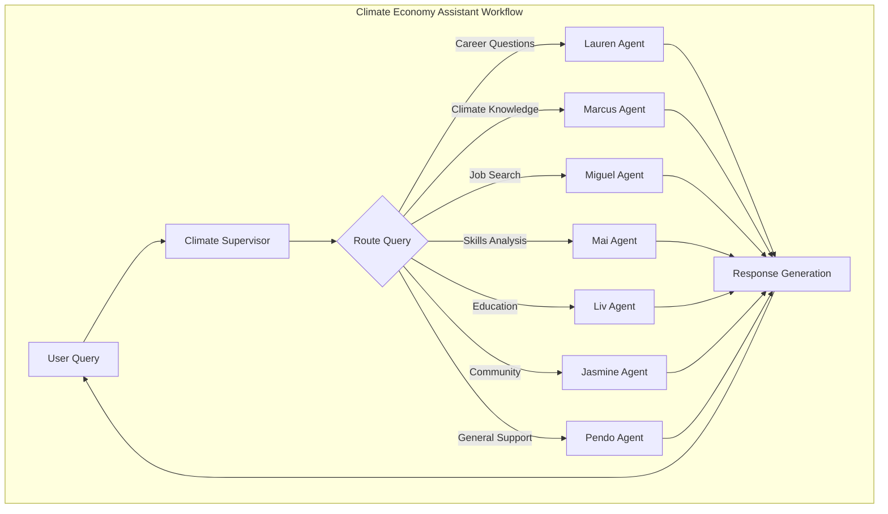
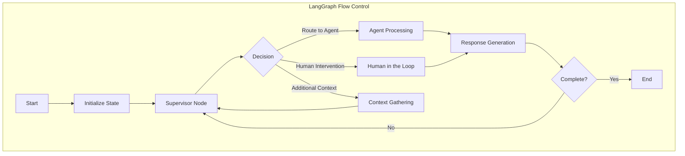
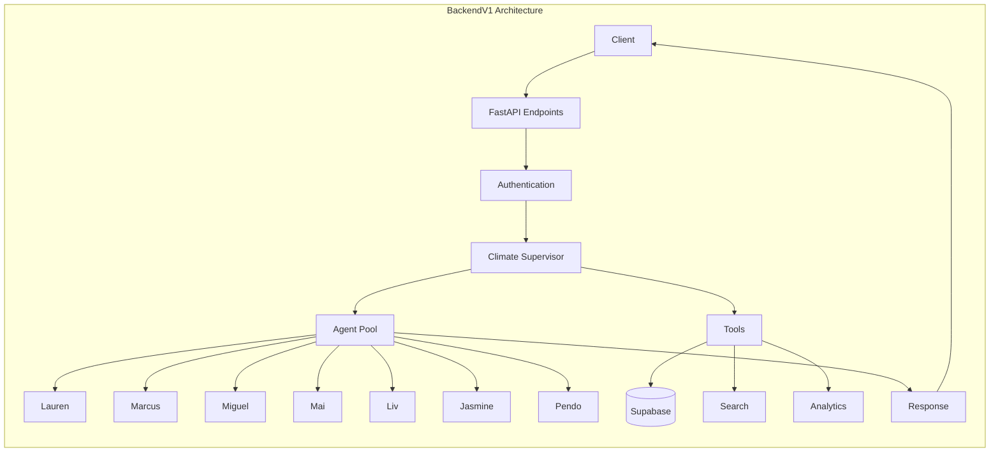
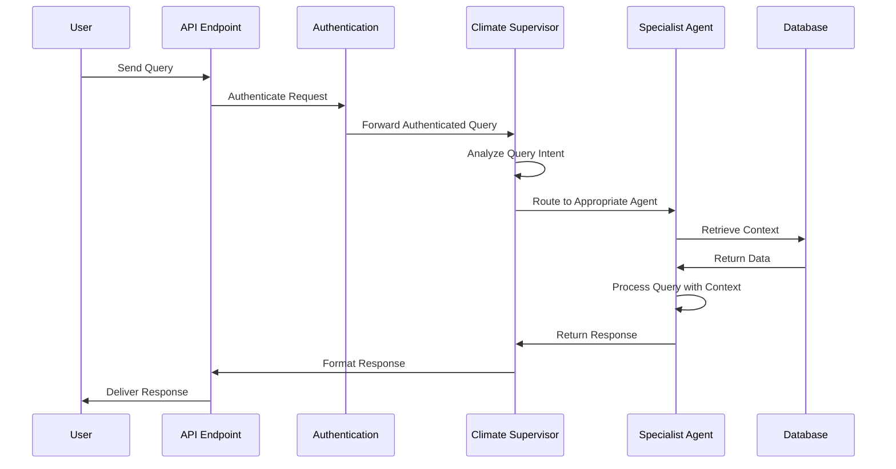
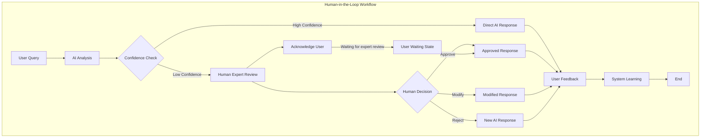

# Climate Economy Assistant Workflow Diagrams

This document contains visual representations of the key workflows in the Climate Economy Assistant system.

## Main Agent Workflow

The Climate Economy Assistant uses a supervisor agent that routes queries to specialized agents based on the query content.



## LangGraph Flow Control

The LangGraph workflow system manages state and flow control between different nodes in the agent system.



## BackendV1 Architecture

The BackendV1 system architecture showing how components interact.



## Query Processing Sequence

Sequence diagram showing the flow of a user query through the system.



## Human-in-the-Loop Workflow

The system includes human review for low-confidence responses. User steering requires immediate feedback to maintain context.




## BackendV1 Architecture

The BackendV1 system architecture showing how components interact.

```mermaid
flowchart LR
    subgraph "BackendV1 Architecture"
    Client[Client] --> API[FastAPI Endpoints]
    
    API --> Auth[Authentication]
